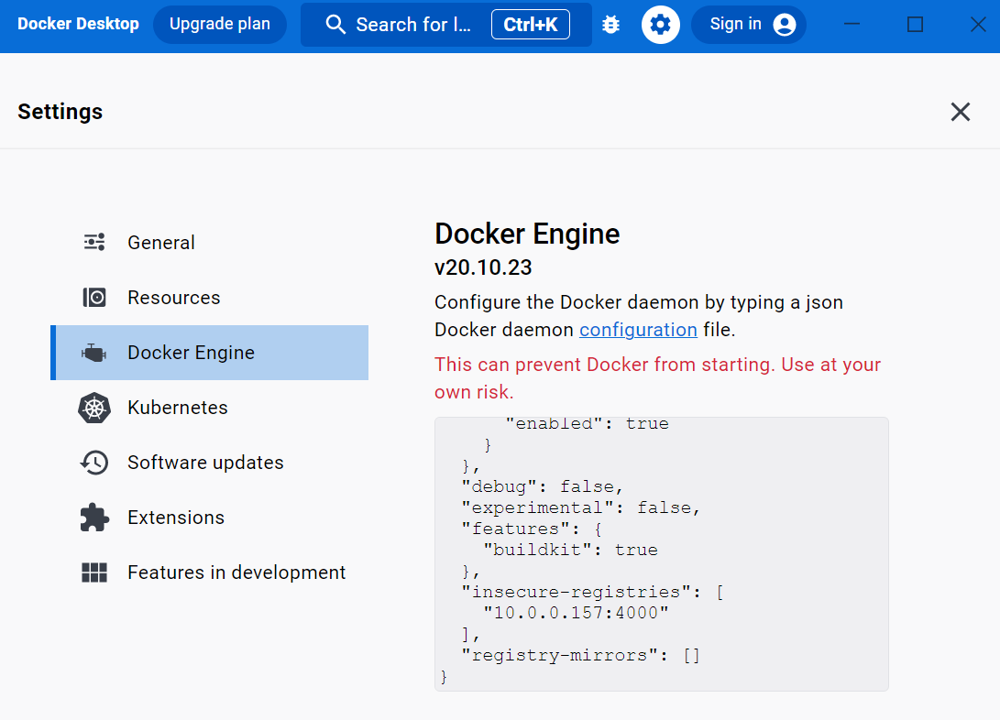

# NextDaemon

Playground for creating Homeassistant Add-Ons based on NetDaemon.

## Steps
1. Created [project with CLI](https://netdaemon.xyz/docs/v3/started/development#2-get-the-project-template) and called it `NextDaemon`.
1. Added MVC and Blazor stuff following the [tutorial](https://netdaemon.xyz/docs/v3/tutorials/webhost).
1. Changed folder structure and moved project to `src` to align with [NetDaemon repository](https://github.com/net-daemon/netdaemon/tree/dev).
1. Added `Dockerfile`, `Dockerfile.AddOn` and sh6 scripts in `Docker`folder from [NetDaemon repository](https://github.com/net-daemon/netdaemon/tree/dev).
1. Run the container locally
    1. Created the image locally with `docker build -t nextdaemon .`
    1. Run it from Docker Desktop and mapped port 10000
    1. NetDaemon *Hello World* Apps run successfully.
    1. Kestrel responding (APIs, ...)
    1. Blazor `Counter` page works including `IScheduler` and HA entities.
    1. **css not working** (-> publish?)

1. [Setting up a local docker registry](https://www.allisonthackston.com/articles/local-docker-registry.html) (so that add-on config.yaml can pull image locally). ()
    1. `docker run -d -p 4000:5000 --restart always --name registry registry:2`
    1. add `{ "insecure-registries": ["local_ip:4000"] }` in Docker Desktop *Settings -> Docker Engine*

    1. `docker tag nextdaemon local_ip:4000/nextdaemon`
    1. `docker push local_ip:4000/nextdaemon`
1. Creating image for AddOn 
    1. `docker build -t nextdaemon-addon -f .\Dockerfile.AddOn .`
    1. `docker tag nextdaemon-addon local_ip:4000/nextdaemon-addon`
    1. `docker push local_ip:4000/nextdaemon-addon`

## Still ToDo
- `config.yaml` to create add-on (pref. from local registry)
- add secrets
- Workflow / Action to deploy docker image
- clean `run` and `finish`scripts
- get the damn thing running!!!