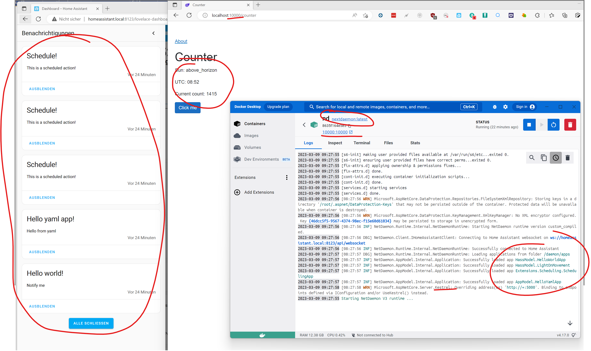

# NextDaemon

Playground for creating Homeassistant Add-Ons based on NetDaemon.

## Steps
1. Created [project with CLI](https://netdaemon.xyz/docs/v3/started/development#2-get-the-project-template) and called it `NextDaemon`.
1. Added MVC and Blazor stuff following the [tutorial](https://netdaemon.xyz/docs/v3/tutorials/webhost).
1. Changed folder structure and moved project to `src` to align with [NetDaemon repository](https://github.com/net-daemon/netdaemon/tree/dev).
1. Added `Dockerfile`, `Dockerfile.AddOn` and sh6 scripts in `Docker`folder from [NetDaemon repository](https://github.com/net-daemon/netdaemon/tree/dev).
1. Run the container locally
    1. Created the image locally with `docker build -t nextdaemon .`
    1. Run it from Docker Desktop and mapped port 10000
    1. NetDaemon *Hello World* Apps run successfully.
    1. Kestrel responding (APIs, ...)
    1. Blazor `Counter` page works including `IScheduler` and HA entities.
    1. **css not working** (-> publish?)

## Still ToDo
- add secrets
- Workflow / Action to deploy docker image
- `config.yaml` to create add-on
- clean `run` and `finish`scripts
- get the damn thing running!!!